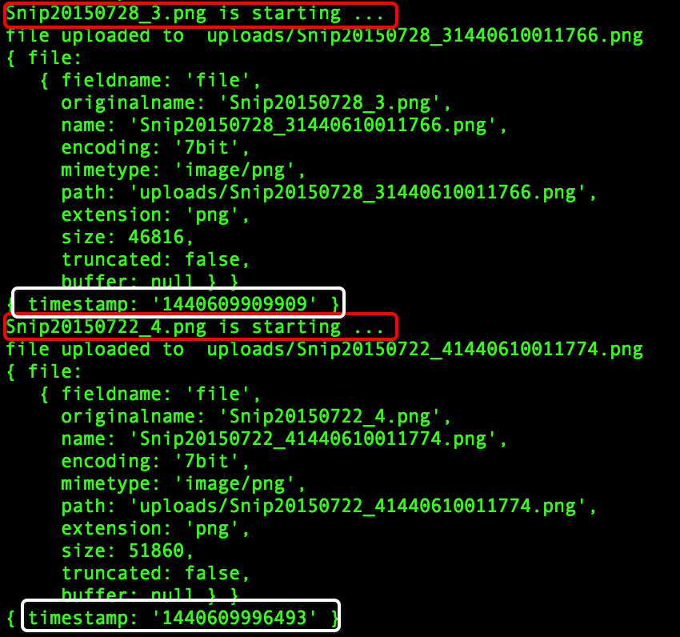

##angularjs+nodejs上传文件时，同时传递其他参数的DEMO
###运行步骤
 1. `npm install`
 2. `bower install`
 3. `node server.js` 
 4. 访问`http://127.0.0.1:9000`
###运行效果如图
 1. 上传了1张图片时，
 2. 上传了2张图片时，
###参考
 - [file-upload-with-angularjs-and-nodejs](https://vcfvct.wordpress.com/2015/02/21/file-upload-with-angularjs-and-nodejs/)，主要描述了前端可以选择的uploader插件，以及后端可以选择的处理文件的组件。
 - [angular-file-upload](https://github.com/zhangw/angular-file-upload)，一个相对简单的uploader插件，肯定比**ng-flow.js**简单。
